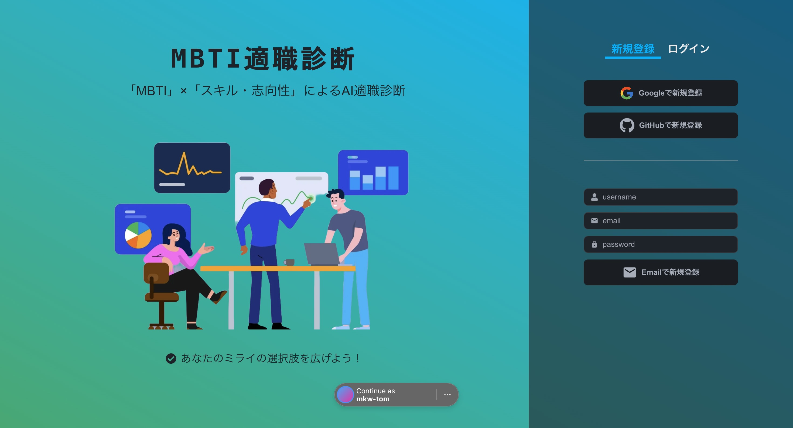
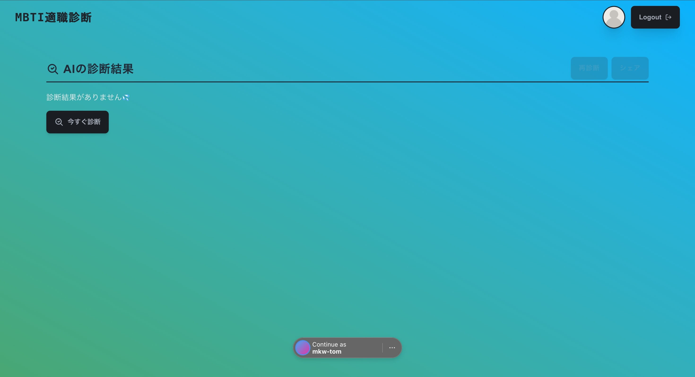
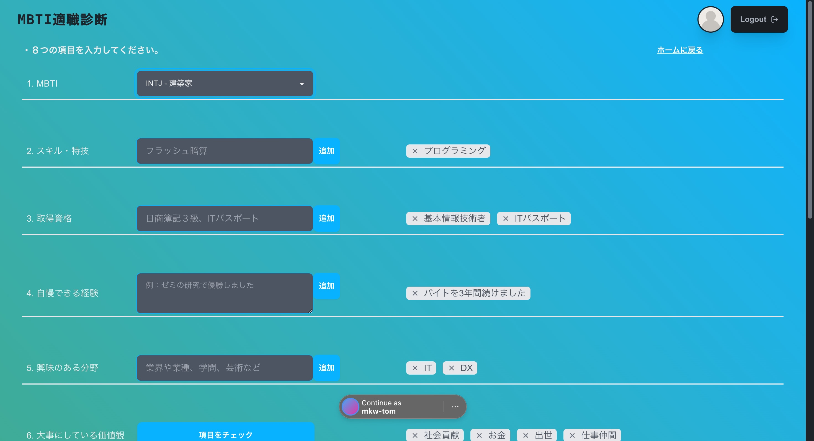
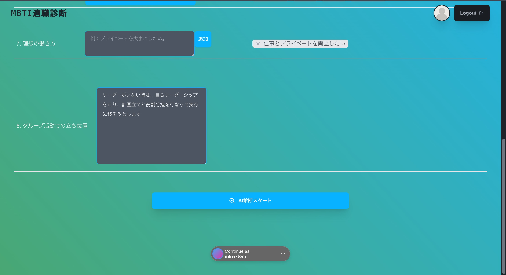
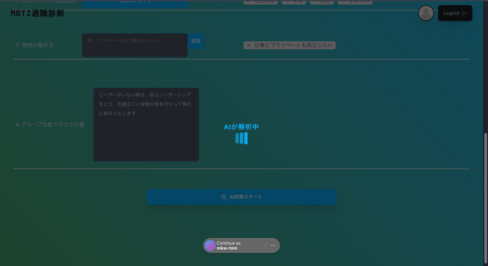
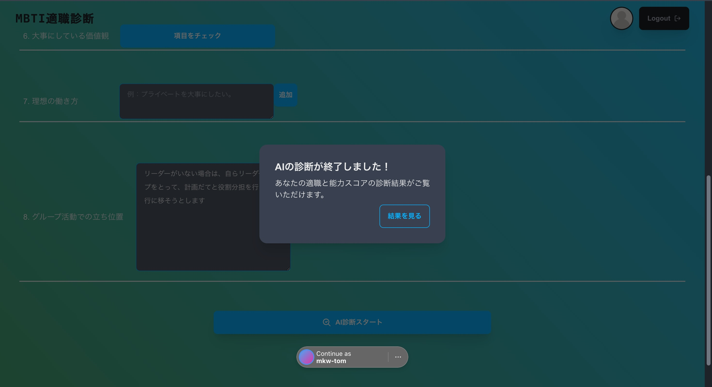
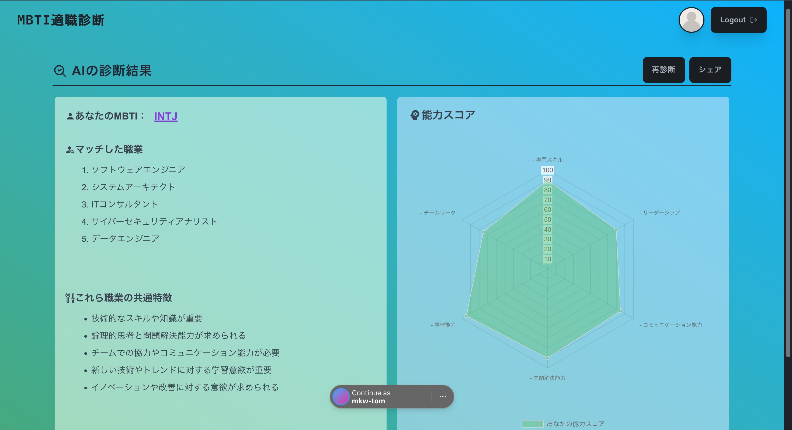
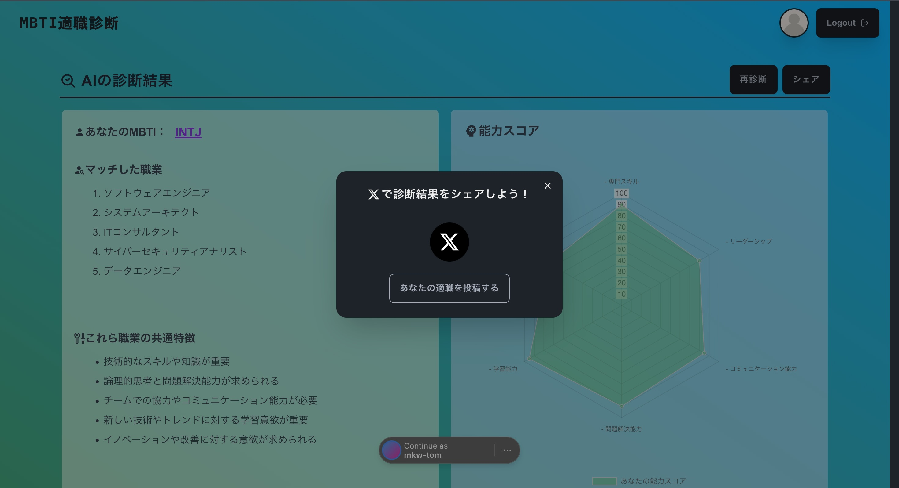

# WorkME　　- AI適職診断 -

[アプリを開く](https://tekishoku-sinndann.vercel.app)

## 技術スタック

### その他ライブラリ

- OpenAI API ⭐
- NextAuth (OAuth・JWT)
- Chart.js
- mongoose
- React Hook Form
- Zod
- daysyUI
- react-icons
- react-share
   
   

## アプリの機能

### ユーザーの「MBTI」と「スキル・志向性」をもとにAIが適職診断

- 1. 「MBTI」と「スキル・志向性」に関する８つの項目を入力
- 2. 1の情報をAI（OpenAIAPI）のプロンプトに読み込ませる
- 3. AIの診断結果から「５つのマッチした職業」・「５つの職業の共通特徴」・「能力スコア」を表示
- 4. 診断結果を「x」でシェア
   

## 画面遷移

- #### トップ

- #### メインページ

- #### 診断フォーム

- #### AI診断中

- #### AI診断成功

- #### AIの診断結果

- #### シェア

